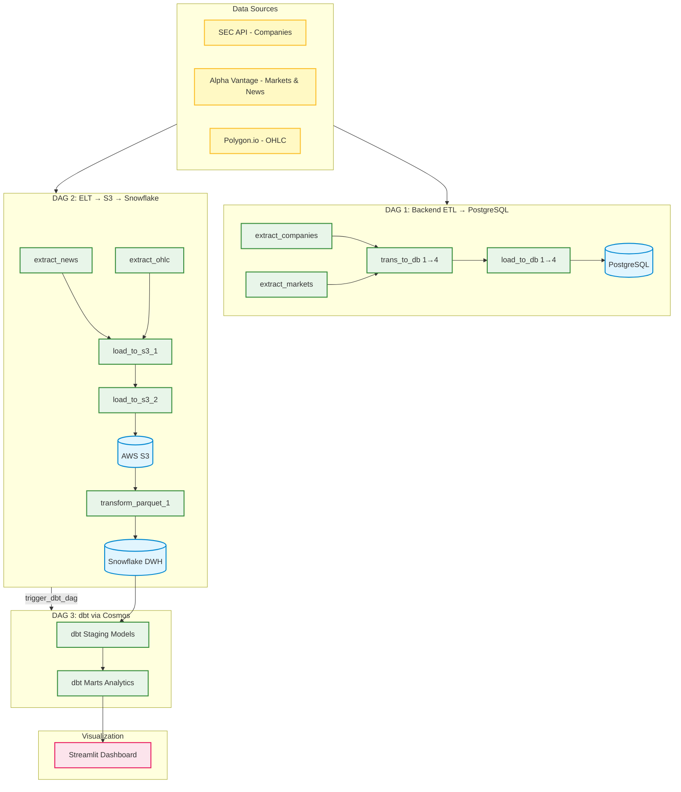

# 📈 Stock Market Analytics & Sentiment Pipeline (Modern Data Stack)

Hệ thống xử lý và phân tích dữ liệu thị trường chứng khoán Hoa Kỳ (US Stock Market) kết hợp dữ liệu giá lịch sử (**OHLC**), dữ liệu metadata doanh nghiệp (**Company & Market**), và phân tích điểm tâm lý báo chí (**News Sentiment Analysis**). Dự án sử dụng mô hình **Modern Data Stack (MDS)** tiêu chuẩn công nghiệp nhằm tự động hóa quy trình thu thập, lưu trữ, biến đổi và trực quan hóa dữ liệu.

---

## 🏗️ Kiến Trúc Hệ Thống (System Architecture)

Dữ liệu di chuyển qua các tầng ETL/ELT khép kín từ các API thô đến giao diện phân tích cuối cùng của người dùng:



---

## 🛠️ Công Nghệ Sử Dụng (Tech Stack)

| Thành phần | Công nghệ |
| :--- | :--- |
| **Orchestration** | Apache Airflow (Astronomer CLI - Astro Runtime 3.2) |
| **dbt Orchestration** | Astronomer Cosmos |
| **Storage & Lake** | AWS S3 (định dạng **Parquet**) |
| **Data Warehouse** | Snowflake Cloud DWH |
| **Data Transformation** | dbt Core (dbt-snowflake) |
| **Visualization** | Streamlit (Plotly, Pandas) |
| **Metadata Database** | PostgreSQL 15 |
| **Containerization** | Docker & Docker Compose |
| **Data Sources** | SEC API, Alpha Vantage API, Polygon.io API |

---

## 📁 Cấu Trúc Thư Mục Dự Án (Project Directory Structure)

```text
stock_project/
├── .astro/                             # Cấu hình Astronomer Airflow
├── dags/                               # Airflow DAGs & mã nguồn ETL/ELT
│   ├── scripts/                        # Định nghĩa các DAGs chạy trên Airflow
│   │   ├── etl_to_db.py                # DAG 1: Extract APIs → Transform → Load vào PostgreSQL
│   │   └── etl_to_dw.py                # DAG 2: Extract APIs → Load S3 → Transform vào Snowflake
│   ├── dbt_dag.py                      # DAG 3: Điều phối dbt qua Astronomer Cosmos
│   ├── backend/                        # Logic ETL cho PostgreSQL (metadata)
│   │   ├── extract/                    # Crawl dữ liệu: extract_companies, extract_markets
│   │   ├── transform/                  # Transform: trans_to_db_1 → trans_to_db_4
│   │   └── load/                       # Load vào PostgreSQL: load_to_db_1 → load_to_db_4
│   ├── elt/                            # Logic ELT cho Data Warehouse
│   │   ├── extract/                    # Crawl dữ liệu: extract_news, extract_ohlc
│   │   ├── load/                       # Chuyển Parquet & upload lên AWS S3
│   │   └── transform/                  # COPY INTO Snowflake & MERGE
│   └── dbt/                            # dbt project
│       └── stock_dbt/
│           ├── models/
│           │   ├── staging/            # 9 dim views (dim_company, dim_ohlc, dim_news...)
│           │   └── marts/              # 6 analytics tables (fact & aggregation)
│           ├── seeds/                  # Dữ liệu static
│           └── dbt_project.yml
├── streamlit/                          # Ứng dụng Dashboard
│   ├── app.py                          # Streamlit Dashboard chính
│   ├── requirements.txt                # Thư viện cho Streamlit container
│   └── Dockerfile                      # Đóng gói ứng dụng Streamlit
├── SQL/                                # SQL scripts khởi tạo schema
│   ├── databases.sql                   # DDL cho PostgreSQL (metadata tables)
│   └── datawarehouse.sql               # DDL cho Snowflake (warehouse, stages, tables)
├── bash/                               # Shell scripts tiện ích
│   ├── run_app.sh                      # Chạy Streamlit app local
│   └── virtual_venv.sh                 # Tạo Python virtual environment
├── data/                               # Dữ liệu raw JSON (mounted vào container)
├── elt_data/                           # Dữ liệu Parquet trung gian
├── Dockerfile                          # Astro Runtime image + dbt venv
├── docker-compose.override.yml         # Override services: Streamlit, PostgreSQL
├── requirements.txt                    # Thư viện Python cho Airflow (cosmos, snowflake)
├── packages.txt                        # System packages cho Airflow
├── airflow_settings.yaml               # Cấu hình connections, pools, variables
└── .env                                # Biến môi trường (API keys, credentials)
```

---

## 🔄 Luồng Vận Hành Tự Động (Orchestration Workflow)

Dự án có **3 DAGs** chạy trên Apache Airflow:

### DAG 1: `Extracing_API_and_load_data_to_database`

> Pipeline ETL nạp metadata doanh nghiệp và thị trường vào PostgreSQL.

* **Tần suất**: Hàng ngày (`0 0 * * *`)
* **Luồng xử lý**:

```text
extract_phase ─→ trans_and_load_1 ─→ trans_and_load_2 ─→ trans_and_load_3 ─→ trans_and_load_4
```

| Phase | Mô tả |
| :--- | :--- |
| `extract_phase` | Trích xuất dữ liệu company (SEC API) & market status (Alpha Vantage) → lưu JSON |
| `trans_and_load_1→4` | Transform JSON thành cấu trúc bảng & load vào PostgreSQL (company, exchange, region, industry, fama, sic) |

---

### DAG 2: `Extracing_API_and_load_data_data_warehouse`

> Pipeline ELT chính: Extract → S3 → Snowflake.

* **Tần suất**: Hàng ngày (`0 12 * * *`)
* **Luồng xử lý**:

```text
extract_phase ─→ load_phase ─→ transform_phase ─→ trigger_dbt_dag
```

| Phase | Mô tả |
| :--- | :--- |
| `extract_phase` | Trích xuất song song dữ liệu OHLC (Polygon.io) & News Sentiment (Alpha Vantage) → lưu JSON |
| `load_phase` | Đọc metadata từ PostgreSQL, gộp tất cả thành Parquet và upload lên AWS S3 |
| `transform_phase` | Tạo Staging tables trong Snowflake, COPY từ S3 & MERGE vào bảng lõi |
| `trigger_dbt_dag` | Kích hoạt DAG 3 (dbt) sau khi hoàn tất |

---

### DAG 3: `dbt_dag`

> Điều phối dbt Core thông qua **Astronomer Cosmos**.

* **Tần suất**: Được trigger tự động bởi DAG 2
* **Luồng xử lý**:

```text
staging (9 dim views) ─→ marts (6 analytics tables)
```

| Phase | Mô tả |
| :--- | :--- |
| `staging` | 9 dimension views: dim_company, dim_exchange, dim_region, dim_industry, dim_fama, dim_sic, dim_ohlc, dim_news, dim_article |
| `marts` | 6 bảng phân tích: fact_ticker, fact_news, daily_stock_performance, industry_performance, company_sentiment, sentiment_price_impact |

---

## 📊 Mô Hình Dữ Liệu Phân Tích (Data Modeling in dbt)

Dữ liệu được dbt làm sạch từ lớp `staging` (materialized as **view**) và tổng hợp tại tầng `marts` (materialized as **table**):

| Bảng Phân Tích (dbt Marts) | Mô tả chi tiết | Các chỉ số chính |
| :--- | :--- | :--- |
| **`daily_stock_performance`** | Phân tích biến động giá cổ phiếu hàng ngày | Giá đóng/mở cửa, khối lượng giao dịch, tỷ lệ lợi nhuận ngày (`daily_return_percentage`) |
| **`industry_performance`** | Phân tích sức mạnh và dòng tiền theo từng nhóm ngành | Tổng khối lượng giao dịch ngành, số lượng mã tăng/giảm giá |
| **`company_sentiment`** | Tổng hợp điểm tâm lý báo chí hàng ngày của doanh nghiệp | Điểm sentiment trung bình (`avg_sentiment_score`), số bài báo tích cực/tiêu cực/trung lập |
| **`sentiment_price_impact`** | Đối chiếu mức độ ảnh hưởng của tâm lý truyền thông lên giá cổ phiếu | Sự tương đồng giữa tín hiệu tin tức và biến động giá thực tế (`sentiment_price_alignment`) |
| **`fact_ticker`** | Bảng fact kết nối thông tin công ty với dữ liệu OHLC | Ticker, company info, exchange, industry |
| **`fact_news`** | Bảng fact kết nối tin tức với sentiment scores | Title, source, sentiment score/label |

---

## 🚀 Hướng Dẫn Cài Đặt & Khởi Chạy (Installation & Quick Start)

### Yêu Cầu Hệ Thống (Prerequisites)

* **Docker** & **Docker Compose**
* **Astronomer CLI** (`astro`)
* Tài khoản **AWS S3**, **Snowflake**, và các API keys

### 1. Chuẩn Bị File Cấu Hình Môi Trường (`.env`)

Tạo file `.env` ở thư mục gốc của dự án với đầy đủ các cấu hình sau:

```env
# API Keys
API_COMPANIES=your_sec_api_key
API_MARKETS=your_alpha_vantage_api_key
API_NEWS=your_alpha_vantage_api_key
API_OHLC=your_polygon_api_key

# PostgreSQL (Metadata)
POSTGRES_HOST=my_new_postgres
POSTGRES_DB=stock_db
POSTGRES_USER=your_postgres_user
POSTGRES_PASSWORD=your_postgres_password
POSTGRES_PORT=5432

# AWS Credentials (S3 Data Lake)
ACCESS_KEY=your_aws_access_key
SECRET_KEY=your_aws_secret_key
REGION=ap-southeast-1

# Snowflake Data Warehouse
SNOWFLAKE_USER=your_snowflake_user
SNOWFLAKE_PASSWORD=your_snowflake_password
SNOWFLAKE_ACCOUNT=your_snowflake_account_id
SNOWFLAKE_WAREHOUSE=dbt_wh
SNOWFLAKE_DATABASE=stock_database
SNOWFLAKE_SCHEMA=stock_schema
SNOWFLAKE_ROLE=dbt_role
```

---

### 2. Khởi Tạo Database & Warehouse

#### PostgreSQL (chạy `SQL/databases.sql`)
Tạo các bảng metadata: `company`, `exchange`, `region`, `industry`, `fama_classification`, `sic_classification`.

#### Snowflake (chạy `SQL/datawarehouse.sql`)
Tạo warehouse, database, schema, storage integration, external stage, và các bảng lõi: `company`, `exchange`, `region`, `industry`, `fama_classification`, `sic_classification`, `news`, `ohlc`, `dim_date`.

---

### 3. Cấu Hình Airflow Connection

Trong Airflow UI, tạo connection `snowflake_conn` với thông tin Snowflake để Cosmos/dbt có thể kết nối.

---

### 4. Khởi Chạy Hệ Thống Bằng Astronomer CLI

```bash
# Di chuyển vào thư mục dự án
cd /path/to/stock_project

# Khởi động toàn bộ hệ thống (Airflow + Streamlit + PostgreSQL)
astro dev start
```

Sau khi khởi động thành công:

| Service | URL | Tài khoản |
| :--- | :--- | :--- |
| **Airflow UI** | `http://localhost:8080` | `admin` / `admin` |
| **Streamlit Dashboard** | `http://localhost:8501` | — |
| **PostgreSQL (metadata)** | `localhost:5433` | Xem `.env` |

> **Lưu ý**: Streamlit container được build từ `streamlit/Dockerfile` và quản lý qua `docker-compose.override.yml`. Khi cần rebuild riêng Streamlit:
> ```bash
> docker build -t stock_project_streamlit ./streamlit
> docker restart stock_project_streamlit
> ```

---

## 📈 Streamlit Dashboard

Ứng dụng Streamlit cung cấp 5 trang phân tích chuyên sâu, kết nối trực tiếp đến Snowflake:

1. **Tổng quan (Overview)** — Giới thiệu hệ thống và hướng dẫn sử dụng.
2. **Hiệu Suất Cổ Phiếu (Daily Performance)** — Biểu đồ tỷ lệ sinh lời hàng ngày theo từng mã cổ phiếu.
3. **Hiệu Suất Ngành (Industry Performance)** — Thống kê khối lượng giao dịch và xu thế dòng tiền theo ngành.
4. **Tâm Lý Tin Tức (Company Sentiment)** — Phân bố điểm tâm lý trung bình để phát hiện rủi ro qua tin tức.
5. **Tác Động Tâm Lý Đến Giá (Sentiment Price Impact)** — Scatter Plot phân tích tương quan giữa sentiment và biến động giá.

---

## 📜 License

This project is for educational and personal portfolio purposes.
